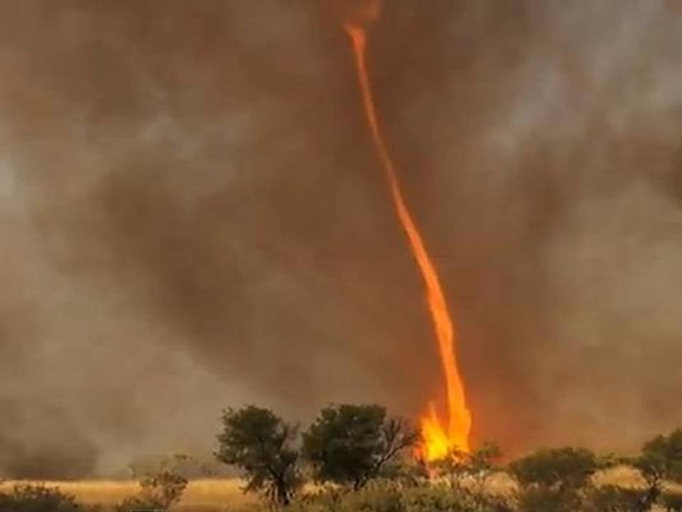
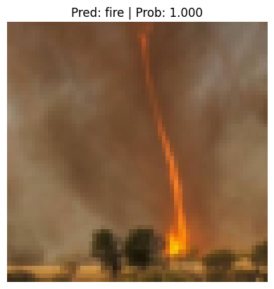
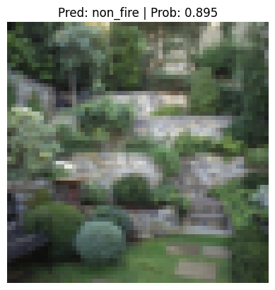

# Fire Classification with CNN (TinyVGG)

This project implements a Convolutional Neural Network (CNN) model based on the TinyVGG architecture to classify images as either containing fire or not. The model is built using PyTorch and was developed as part of a challenge to create a reliable fire detection system.

## Table of Contents
- [Project Overview](#project-overview)
- [Dataset](#dataset)
- [Model Architecture](#model-architecture)
- [Usage](#usage)
- [Results](#results)
- [Testing with Sample Images](#testing-with-sample-images)
- [Contact](#contact)

## Project Overview
The goal of this project is to train a deep learning model that can classify images as either containing fire or not. The model is intended to assist in early fire detection, which is crucial for preventing wildfires and minimizing damage. Note: This project used 25 epochs to train the CNN model, but more epochs should be considered to improve the model's performance and accuracy.

## Dataset
### Context
The dataset used in this project was created by a team during the NASA Space Apps Challenge in 2018. The challenge aimed to develop a model capable of recognizing fire in images. For more information on the context of the dataset, please visit the Kaggle page at [this link](https://www.kaggle.com/datasets/phylake1337/fire-dataset).

### Content
The dataset consists of images divided into two categories:
- **fire_images**: Contains 755 images of outdoor scenes with visible fire. Some images also contain heavy smoke.
- **non_fire_images**: Contains 244 images of nature scenes, including forests, trees, rivers, foggy forests, lakes, animals, roads, and waterfalls.

### Note
The dataset is imbalanced, with more images of fire than non-fire. It is recommended to create a validation set with an equal number of images per class (e.g., 40 images of fire and 40 images of non-fire) to avoid bias in model evaluation.

## Model Architecture
The model is based on the TinyVGG architecture, a simplified version of the VGG network. The architecture consists of two convolutional blocks followed by a fully connected layer. Here's a summary of the architecture:

## Usage

1. Clone the repository:
   ```bash
   git clone https://github.com/yourusername/fire-classification-cnn.git
   cd fire-classification-cnn
   ```
## Results
The performance of the model was evaluated using several metrics and visualizations, which are described below:

### 1. Loss Curves
The loss curves for both training and testing were plotted to provide a clear view of the model's convergence.

**Loss Curves**:
- The loss curves offer insights into how quickly the model is learning and whether it is suffering from overfitting or underfitting.


### 2. Model Performance Over Epochs
The performance of the model was tracked over each epoch to monitor its learning progress.

**Training and Testing Accuracy**:
- Accuracy was plotted for both the training and testing sets over the epochs to visualize the model’s learning curve and final performance.


### 3. Rate Analysis
Rate analysis focused on the rate of change in loss and accuracy during training. This helps in understanding the learning dynamics and determining whether the model is converging.

**Rate of Change in Loss and Accuracy**:
- Plots were generated to show how the training and testing loss decreased and how accuracy improved over time.


### 4. Gap Analysis
A gap analysis was performed to evaluate the difference between the training and testing loss over epochs. This analysis helps identify whether the model is overfitting (training loss is significantly lower than testing loss) or underfitting (both training and testing losses are high).

**Training vs. Testing Loss Gap**:
- A plot was generated to visualize the gap between training and testing loss as the model trained over 25 epochs.


These plots and analyses collectively provide a comprehensive view of the model's performance throughout the training process.

### Saved Model

The trained model has been saved and can be reused for inference or further fine-tuning. It is stored in the `results` folder under the filename:

**`pytorch_fire_classification_model_0.pth`**

## Testing with Sample Images

The trained model in this project has been tested using two sample images to evaluate its accuracy and performance.

### First Sample
The first original sample image is:
<p align="center">
  
</p>

The model's result on this image is shown below. The prediction class label and predicted probability are indicated on the result image:
<p align="center">
  
</p>

### Second Sample
The second original sample image is:
<p align="center">
  
</p>

The model's result on this image is shown below. The prediction class label and predicted probability are indicated on the result image:
<p align="center">
  
</p>

## Contact

Please feel free to contact me via email at mo.alirez77habibi@gmail.com.
